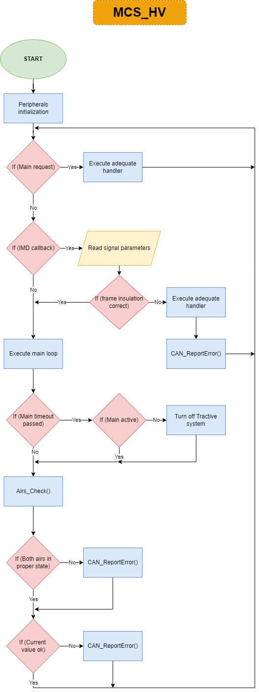

# MCS_hv

Adresses:

TxID: **0x001A**

RxID: **0x001F**

# Request
1) AIRs average current value:

|RxID  |2      |0x3D   |0x01   |
|------|-------|-------|-------|
|      |DLC    |READ   |RegID  |

2) Tractive system activation:

|RxID            |3      |       |0x02   |0xNN       |Range |Units|
|----------------|-------|-------|-------|-----------|------|-----|
|                |DLC    |WRITE  |RegID  |data[0-7]  |8bit  |0-1  |
|(1-0N, 0-OFF)   |       |       |       |           |      |     |

3) Insulation resistance value:

|RxID  |2      |0x3D   |0x03   |
|------|-------|-------|-------|
|      |DLC    |READ   |RegID  |

4) MAIN status monitor:

|RxID                           |3      |       |0x04   |0xNN       |Range |Units|
|-------------------------------|-------|-------|-------|-----------|------|-----|
|                               |DLC    |WRITE  |RegID  |data[0-7]  |8bit  |0-1  |
|MAIN status value:(1-0N, 0-OFF)|       |       |       |           |      |     |

# Respond
1) AIRs average current value:

|TxID  |3      |0x02   |0xNN      |0xNN       |Range |Units    |
|------|-------|-------|----------|-----------|------|---------|
|      |DLC    |RegID  |data[0-7] |data[8-15] |16bit |0-65536  |

2) Insulation resistance value:

|TxID  |3      |0x02   |0xNN      |0xNN       |Range |Units    |
|------|-------|-------|----------|-----------|------|---------|
|      |DLC    |RegID  |data[0-7] |data[8-15] |16bit |0-65536  |

# Error list
1) AIR_P overcurrent:

|TxID  |2      |0x1D   |0x01   |
|------|-------|-------|-------|
|      |DLC    |ERROR  |Code   |

2) AIR_N overcurrent:

|TxID  |2      |0x1D   |0x02   |
|------|-------|-------|-------|
|      |DLC    |ERROR  |Code   |

3) AIR_P status Error:

|TxID  |2      |0x1D   |0x03   |
|------|-------|-------|-------|
|      |DLC    |ERROR  |Code   |

4) AIR_P status Error:

|TxID  |2      |0x1D   |0x04   |
|------|-------|-------|-------|
|      |DLC    |ERROR  |Code   |

5) IMD short cicruit to supply voltage error:

|TxID  |2      |0x1D   |0x05   |
|------|-------|-------|-------|
|      |DLC    |ERROR  |Code   |

6) IMD insulation measurement error:

|TxID  |2      |0x1D   |0x06   |
|------|-------|-------|-------|
|      |DLC    |ERROR  |Code   |

7) IMD undervoltage error:

|TxID  |2      |0x1D   |0x07   |
|------|-------|-------|-------|
|      |DLC    |ERROR  |Code   |

8) IMD speed start error:

|TxID  |2      |0x1D   |0x08   |
|------|-------|-------|-------|
|      |DLC    |ERROR  |Code   |

9) IMD device error:

|TxID  |2      |0x1D   |0x09   |
|------|-------|-------|-------|
|      |DLC    |ERROR  |Code   |

10) IMD connection fault error:

|TxID  |2      |0x1D   |0x0A   |
|------|-------|-------|-------|
|      |DLC    |ERROR  |Code   |

11) IMD malfunction error:

|TxID  |2      |0x1D   |0x0B   |
|------|-------|-------|-------|
|      |DLC    |ERROR  |Code   |

12) AIRs current divergence error:

|TxID  |2      |0x1D   |0x0C   |
|------|-------|-------|-------|
|      |DLC    |ERROR  |Code   |
